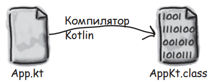

# 2.2 Переменные

Переменнная - контейнер, содержащий какое-либо значение примитивного типа данных, либо ссылку на объект класса.

При компиляции кода Kotlin в байт-код Java компилятор, если есть такая возможность, будет использовать примитивы Java, так как они обеспечивают лучушую производительность.

В Java переменные могут хранить только значения байтов ([источник](https://javarush.com/groups/posts/630-primitivnihe-tipih-v-java--ne-takie-uzh-oni-i-primitivnihe)):

- примитивные типы переменных хранят непосредственно значение байтов данных;
- ссылочные типы переменных хранят байты адреса объекта в *heap*.

Вероятно, в Kotlin Native предусмотрены только ссылочные переменные.

Примитивные типы данных в Java: `byte`, `short`, `int`, `long`, `double`, `float`, `boolean`, `char`;  
Ссылочные типы данных: те, что создаются с помощью конструкторов классов.

| Примитивные переменные                                                        | Ссылочные переменные                                                                                      |
|-------------------------------------------------------------------------------|-----------------------------------------------------------------------------------------------------------|
| Хранят **значение**.                                                          | Хранят **адрес объекта** в памяти                                                                         |
| Создаются присваиванием значения                                              | Создаются через конструктор класса (присваивание только создаёт **вторую ссылку** на существующий объект) |
| Имеют строго заданный диапазон допустимых значений                            | ---                                                                                                       |
| Значение по умолчанию зависит от типа (`int` - `0`, `float` - `0.0f`)         | Значение по умолчанию - `null` (нет ссылки)                                                               |
| В аргументы методов попадают копии значения переменной (передача по значению) | В аргументы методов попадают значения ссылки. Операции выполняются над оригинальным объектом.             |
| ---                                                                           | Могут исопользоваться для ссылки на объект объявленного или совместимого типа данных                      |

## Изменяемые и неизменяемые переменные

Kotlin - статически типизированный язык - типы переменных проверяются компилятором во время компиляции, а не во время выполнения.

Перед использованием переменной необходимо обязательно инициализровать её начальным значением, иначе будет выведена ошибка. Синтаксис объявления и инициализации переменной:

```kotlin
<тип_переменной_(val_или_var)> <имя_переменной>: <тип данных> = <значение_или_объект>
```

```kotlin
val a: Int      // Объявление переменной.
a = 5           // Инициализация переменной.
val b: Int = 5  // Можно инициализировать переменную сразу после объявления. 
```

Также Kotlin поддерживает *type inference* - автоматическое выведение типов. Kotlin может сам определить тип для переменной на основе типа передаваемого объекта.

```kotlin
val a = 5       // 1. Компилятор видит, что значение `5` является целым число. 
                //    Создаётся объект `5` типа `Int`.
                // 2. На основе типа объекта будет выведен тип переменной `a` - `Int`.
                //    Этот тип навсегда закрепляется за переменной. 
                // 3. В переменной `a` сохраняется ссылка на объект `5`.
```

{: style="width:200px"}

Если переменная объявляется с ключевым словом `val`, то ссылка на объект сохраняется раз и навсегда и не может быть заменена (*immutable variable*).  
Если переменная объявляется с ключевым словом `var`, то ссылка на объект может быть заменена ссылкой на другой объект того же или совместимого типа (*mutable variable*).

```kotlin
var a = 5       // Если не планируется менять значение переменной, строго рекомендуется определять её с val.
a = 6
a = 7
```

## Определение констант времени компиляции

Свойства констант времени компиляции:

- значение констант времени компиляции устанавливается во время компиляции (значение `val` переменных устанавливается во время выполнения);
- тип данных константы должен соответствовать примитивному + либо `String`;
- константа должна объявляться на самом верхнем уровне (вне класса и функций);
- нельзя изменить значение константы.

```kotlin
const val maxAge = 120  // Константа времени компиляции

fun main() {
    println(maxAge)
}
```

## Что делает команда Run?

При выполнении команды Run интегрированная среда разработки (IDE - Integrated Development Environment) выполняет пару операций перед тем, как показать вывод вашего кода:

1. IDE компилирует исходный код Kotlin в байт-код JVM (Java Virtual Machine). Если код не содержит ошибок компиляции, создаётся один или несколько файлов классов, которые могут выполняться на JVM. Например, из файла `App.kt` будет создан файл класса с именем `AppKt.class`.  
    {: style="width:300px"}  
2. IDE запускает JVM и выполняет файл класса `AppKt.class`. JVM преобразует байт-код в формат, понятный для текущей платформы.  
    {: style="width:300px"}  

## Компиляторы и интерпретаторы

Инструкции интерпретируемого языка выполняются непосредственно программой, называемой интерпретатором. Инструкции компилируемого языка преобразуются в представление, которое выполняется как собственная программа либо непосредственно на аппаратном процессоре, либо на виртуальной машине, эмулирующей процессор.

Языки *C*, *C++*, *Go*, *Rust* компилируются в машинный код, который работает непосредственно на аппаратном центральном процессоре. Такие языка, как Kotlin и Java компилируются в байт-код (формат промежуточного уровня), который выполняется на виртуальной машине JVM. Преимущество JVM - переносимость. Один и тот же байт-код может работать на любом устройстве с виртуальной машиной JVM. Виртуальные машины оптимизируются для конкретного оборудования. JVM содержит много лет таких оптимизаций на множестве платформ.

Исходный код Kotlin может быть скомпилирован для работы на различных платформах:

- JVM. Исходный код компилируется в байт-код JVM и может быть запущен на любой виртуальной машине JVM.
- Android. Исходный код проходит ряд компиляций: Kotlin -> JVM -> Dalvik. Android имеет свою среду выполнения ART, исполняющую файлы `*.dex`.
- JavaScript. Для запуска в веб-браузере.
- Машинный код. Собственные двоичные файлы, скомпилированные для конкретных платформ и процессоров.

## Резюме

```kotlin
// Переменнная - контейнер, содержащий какое-либо значение примитивного типа данных, 
// либо ссылку на объект класса.

fun main() {
    val с: Int      // Объявление immutable-переменной (ссылку нельзя будет сменить).
    с = 5           // Инициализация переменной.
    val b: Int = 5  // Можно инициализировать переменную сразу после объявления. 

    val a = 5       // 1. Компилятор видит, что значение `5` является целым число. 
                    //    Создаётся объект `5` типа `Int`.
                    // 2. На основе типа объекта будет выведен тип переменной `a` - `Int`.
                    //    Этот тип навсегда закрепляется за переменной. 
                    // 3. В переменной `a` сохраняется ссылка на объект `5`.
    var d = 5       // Объявление immutable-переменной (можно изменить ссылку на другой объект того же или 
                    // совместимого типа). Если не планируется менять значение переменной, строго рекомендуется 
                    // определять её с val.
}
```

