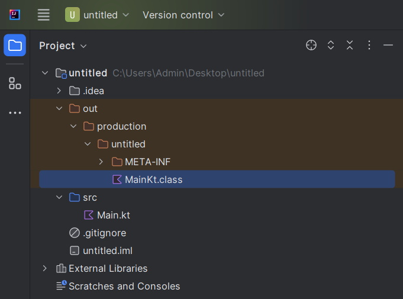

# 2.9 Диапазоны (range)

Диапазон представляет собой некоторый интервал значений. Для
создания диапазона применяется оператор `..` или ключевой слово `until `. Разница между этими способами заключается лишь в том, что при использовании `until` в диапазон не включается последнее значение. 

```kotlin
val range = 1..5        // диапазон [1, 2, 3, 4, 5]
val range2 = 1 until 5  // диапазон [1, 2, 3, 4]
```

Объекты диапазонов могут быть следующих типов:

* `IntRange`;
* `LongRange`;
* `CharRange`;
* `ClosedRange<Float>` - не поддерживает итерацию;
* `ClosedRange<Double>` - не поддерживает итерацию.

```kotlin
val range1: IntRange = 1 until 5
val range2: LongRange = 42L..442L
val range3: CharRange = 'a'..'z'
val range4: ClosedRange<Double> = 42.1..442.1
val range5: ClosedRange<Float> = 42.1f..442.1f
```

В случае с `CharRange` итерация по символам работать будет, потому что все символы “под капотом” кодируются в целые числа.

```kotlin
for (i in range3) {
    print(i)
}
```

```commandline
abcdefghijklmnopqrstuvwxyz
```

Оператор `..` позволяет создать диапазон по нарастающей, где каждый следующий элемент будет больше предыдущего. С помощью специальной функции `downTo` можно построить диапазон в обратном порядке:

```kotlin
val range =  5 downTo 1    // 5 4 3 2 1
println(range)
```

```commandline
5 downTo 1 step 1
```

Еще одна специальная функция `step` позволяет задать шаг, на который будут изменяться последующие элементы:

```kotlin
val range1 = 1..10 step 2           // 1 3 5 7 9
val range2 = 10 downTo 1 step 3     // 10 7 4 1
```

Еще одна функция `until` позволяет не включать верхнюю границу в диапазон:

```kotlin
val range1 = 1 until 9          // 1 2 3 4 5 6 7 8
val range2 = 1 until 9 step 2   // 1 3 5 7
range2
```

```commandline
1..7 step 2
```

С помощью специальных операторов можно проверить наличие или отсутствие
элементов в диапазоне:

- `in`: возвращает `true`, если объект имеется в диапазоне;
- `!in`: возвращает `true`, если объект отсутствует в диапазоне.

```kotlin
fun main() {

    val range = 1..5

    var isInRange = 5 in range
    println(isInRange)      // true

    isInRange = 86 in range
    println(isInRange)      // false

    var isNotInRange = 6 !in range
    println(isNotInRange)   // true

    isNotInRange = 3 !in range
    println(isNotInRange)   // false
}
```

## Перебор диапазона

С помощью цикла `for` можно перебирать диапазон:

```kotlin
val range1 = 5 downTo 1 
for(c in range1) print(c)       // 54321
println()

val range2 = 'a'..'d'
for(c in range2) print(c)       // abcd
println()

for(c in 1..9) print(c)         // 123456789
println()

for(c in 1 until 9) print(c)    // 12345678
println()

for(c in 1..9 step 2) print(c)  // 13579
```

```commandline
54321
abcd
123456789
12345678
13579
```

```kotlin
val range = 1..5
range
```

```commandline
1..5
```

## Диапазоны, прогрессии "под капотом" и декомпилирование

Диапазоны и прогрессии сами по себе не являются итераторами. Для их превращения в итератор вызывается функция `iterator()` ([источник](https://younglinux.info/kotlin/range)).

Диапазоны "под капотом" языка Kotlin представляют собой объект с определенными свойствами и методами, в рамках которых описано его поведение при осуществелении итерирования (`i in объект`). 

Как известно, при запуске программы IDE компилирует исходный код Kotlin в байт-код JVM (Java Virtual Machine). Если код не содержит ошибок, при компиляции создается один или несколько файлов классов, которые могут выполняться JVM. Грубо говоря, Kotlin JVM является оболочкой языка Java, предоставляющей альтернативный синтаксис. При декомпиляции файла может быть получен исходный код Java. 

В директории проекта скомплированный класс находится в папке output:
    
</img>

Рассмотрим декомпилированный код, содержащий интервалы. Декомпиляция выполнена на ресурсе http://www.javadecompilers.com/.

### Пример 1

**Kotlin:**
```kotlin
fun main() {
    for (i in 1..5) {
        print(i)
    }
}
```

**Java:**
```java
import kotlin.Metadata;

@Metadata(
   mv = {1, 9, 0},
   k = 2,
   xi = 48,
   d1 = {"\u0000\b\n\u0000\n\u0002\u0010\u0002\n\u0000\u001a\u0006\u0010\u0000\u001a\u00020\u0001¨\u0006\u0002"},
   d2 = {"main", "", "untitled"}
)
public final class MainKt {
   public static final void main() {
      for(int i = 1; i < 6; ++i) {
         System.out.print(i);
      }

   }

   // $FF: synthetic method
   public static void main(String[] args) {
      main();
   }
}
```

### Пример 2

**Kotlin:**
```kotlin
fun main() {
    for (i in 1..10 step 2) {
        print(i)
    }
}
```

**Java:**
```java
import kotlin.Metadata;
import kotlin.internal.ProgressionUtilKt;

@Metadata(
   mv = {1, 9, 0},
   k = 2,
   xi = 48,
   d1 = {"\u0000\b\n\u0000\n\u0002\u0010\u0002\n\u0000\u001a\u0006\u0010\u0000\u001a\u00020\u0001¨\u0006\u0002"},
   d2 = {"main", "", "untitled"}
)
public final class MainKt {
   public static final void main() {
      int i = 1;
      int var1 = ProgressionUtilKt.getProgressionLastElement(1, 10, 2);
      if (i <= var1) {
         while(true) {
            System.out.print(i);
            if (i == var1) {
               break;
            }

            i += 2;
         }
      }

   }

   // $FF: synthetic method
   public static void main(String[] args) {
      main();
   }
}
```

Как видно из декомпилированного кода, исходный объект интервалов преобразуется в цикл `for`, а прогрессия в цикл `while (true)`.

## Резюме

```kotlin
fun main() {
    val range = 1..5          // диапазон [1, 2, 3, 4, 5]
    val range2 = 5 downTo 1   // диапазон в обр. порядке  [5, 4, 3, 2, 1]
    val range3 = 1..5 step 2  // диапазон c шагом [1, 3, 5]
    val range4 = 1..<5        // диапазон [1, 2, 3, 4]
    val range5 = 1 until 5    // диапазон [1, 2, 3, 4] старая запись

    // Объекты диапазонов могут быть следующих типов:
    // - IntRange
    val intRange: IntRange = 1..5

    // - LongRange
    val longRange: LongRange = 1L..5L

    // - CharRange
    // символы “под капотом” кодируются в целые числа.
    val charRange: CharRange = 'a'..'d'

    // - ClosedRange<Double> - не поддерживает итерацию;
    val closedRangeDouble: ClosedRange<Double> = 1.1..5.1

    // - ClosedRange<Float> - не поддерживает итерацию
    val closedRangeFloat: ClosedRange<Float> = 1.1f..5.1f

    println(range2.toList())
}
```

